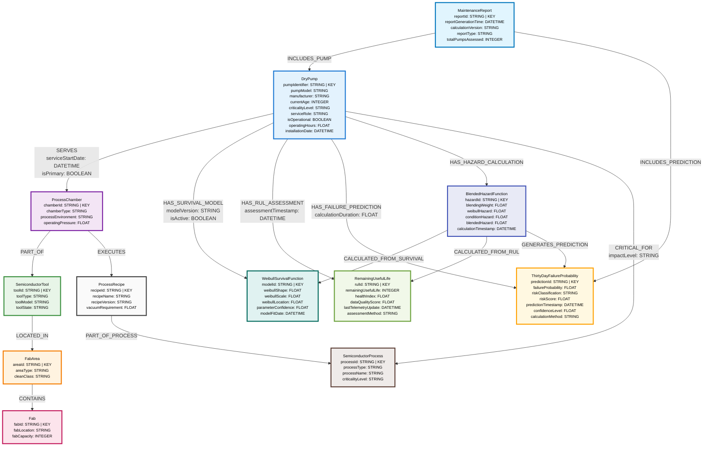

# Neo4j Knowledge Graph Model for Vacuum Dry Pump Predictive Maintenance

> **Status**: ✅ **APPROVED** - Ready for Step 7 Implementation
> 
> **Model Version**: v1.0
> 
> **Date**: July 21, 2025

## Overview

This document defines the complete Neo4j knowledge graph model for our AI-driven predictive maintenance system. The model directly supports the mathematical foundation of **30-day failure probability calculation** using **Weibull survival analysis** combined with **real-time condition monitoring**.

### Mathematical Foundation
```
P_30(t) = 1 - exp[-(λ_W(t) + k·λ_R(t))]

Where:
- λ_W(t) = ((t+30)^ρ - t^ρ)/β^ρ  [Weibull cumulative hazard]
- λ_R(t) = 30/RUL(t)              [Condition cumulative hazard]  
- k ∈ [0,1]                       [Blending weight]
- ρ, β                            [Weibull shape, scale parameters]
- t                               [Current pump age in days]
- RUL(t)                          [Remaining Useful Life]
```

## Knowledge Graph Structure



## Node Definitions

### 🔧 **Equipment Hierarchy Nodes**

#### **DryPump** (Core Entity)
**Purpose**: Central entity representing vacuum dry pumps in semiconductor manufacturing

| Property | Type | Required | Description | Example |
|----------|------|----------|-------------|---------|
| `pumpIdentifier` | STRING | ✅ | Unique pump identifier (KEY) | "P001" |
| `pumpModel` | STRING | ✅ | Manufacturer model | "Edwards nXDS20i" |
| `manufacturer` | STRING | ❌ | Equipment manufacturer | "Edwards Vacuum" |
| `currentAge` | INTEGER | ✅ | Age in days since installation | 400 |
| `criticalityLevel` | STRING | ✅ | Business impact level | "Level4" |
| `serviceRole` | STRING | ✅ | Pump function | "Primary" |
| `isOperational` | BOOLEAN | ✅ | Current operational status | true |
| `operatingHours` | FLOAT | ❌ | Total operating hours | 9600.5 |
| `installationDate` | DATETIME | ❌ | Installation timestamp | "2024-04-15T08:00:00Z" |

**Business Rules**:
- `criticalityLevel` ∈ {Level1, Level2, Level3, Level4, Level5}
- `serviceRole` ∈ {Primary, Backup, Roughing}
- `currentAge` ≥ 0

#### **ProcessChamber** (Manufacturing Context)
**Purpose**: Represents semiconductor process chambers that require vacuum pumps

| Property | Type | Required | Description | Example |
|----------|------|----------|-------------|---------|
| `chamberId` | STRING | ✅ | Chamber identifier (KEY) | "CH1" |
| `chamberType` | STRING | ✅ | Chamber type | "Process" |
| `processEnvironment` | STRING | ❌ | Environment type | "Vacuum" |
| `operatingPressure` | FLOAT | ❌ | Target vacuum level | 1e-6 |

**Business Rules**:
- `chamberType` ∈ {Process, LoadLock, Transfer}
- `processEnvironment` ∈ {Vacuum, Atmospheric, Inert}

#### **SemiconductorTool** (Tool Level)
**Purpose**: Manufacturing tools containing process chambers

| Property | Type | Required | Description | Example |
|----------|------|----------|-------------|---------|
| `toolId` | STRING | ✅ | Tool identifier (KEY) | "ETCH_02" |
| `toolType` | STRING | ✅ | Tool type | "Etch" |
| `toolModel` | STRING | ❌ | Manufacturer model | "Applied Materials Centura" |
| `toolState` | STRING | ❌ | SEMI E10 state | "PRODUCTIVE" |

**Business Rules**:
- `toolType` ∈ {Etch, Deposition, Implant, Litho, Metrology, Clean}
- `toolState` ∈ {PRODUCTIVE, STANDBY, ENGINEERING, DOWN}

#### **FabArea** (Area Level)
**Purpose**: Cleanroom areas containing semiconductor tools

| Property | Type | Required | Description | Example |
|----------|------|----------|-------------|---------|
| `areaId` | STRING | ✅ | Area identifier (KEY) | "DRY_ETCH" |
| `areaType` | STRING | ✅ | Area type | "DryProcessArea" |
| `cleanClass` | STRING | ❌ | ISO clean class | "ISO5" |

#### **Fab** (Facility Level)
**Purpose**: Semiconductor fabrication facility

| Property | Type | Required | Description | Example |
|----------|------|----------|-------------|---------|
| `fabId` | STRING | ✅ | Fab identifier (KEY) | "FAB1" |
| `fabLocation` | STRING | ❌ | Geographic location | "Austin, TX" |
| `fabCapacity` | INTEGER | ❌ | Wafer processing capacity | 50000 |

### 🧮 **Mathematical Model Nodes**

#### **WeibullSurvivalFunction** (Survival Analysis)
**Purpose**: Stores Weibull distribution parameters for historical lifetime modeling

| Property | Type | Required | Description | Example |
|----------|------|----------|-------------|---------|
| `modelId` | STRING | ✅ | Model identifier (KEY) | "WEIBULL_P001_v1.2" |
| `weibullShape` | FLOAT | ✅ | Shape parameter (ρ) | 1.42 |
| `weibullScale` | FLOAT | ✅ | Scale parameter (β) in days | 527.44 |
| `weibullLocation` | FLOAT | ❌ | Location parameter (γ) | 0.0 |
| `parameterConfidence` | FLOAT | ❌ | Model confidence [0,1] | 0.85 |
| `modelFitDate` | DATETIME | ❌ | When model was fitted | "2025-01-15T00:00:00Z" |

**Mathematical Constraints**:
- `weibullShape` > 0 (shape parameter must be positive)
- `weibullScale` > 0 (scale parameter must be positive)
- `parameterConfidence` ∈ [0,1]

#### **RemainingUsefulLife** (Condition Monitoring)
**Purpose**: Real-time health assessment and RUL estimation

| Property | Type | Required | Description | Example |
|----------|------|----------|-------------|---------|
| `rulId` | STRING | ✅ | RUL assessment identifier (KEY) | "RUL_P001_20250721" |
| `remainingUsefulLife` | INTEGER | ✅ | RUL in days | 180 |
| `healthIndex` | FLOAT | ✅ | Anomaly score [0=nominal, 1=degraded] | 0.15 |
| `dataQualityScore` | FLOAT | ❌ | Data reliability [0,1] | 0.92 |
| `lastTelemetryUpdate` | DATETIME | ❌ | Most recent data timestamp | "2025-07-21T09:45:00Z" |
| `assessmentMethod` | STRING | ❌ | Assessment algorithm | "TelemetryBased" |

**Mathematical Constraints**:
- `remainingUsefulLife` ≥ 0
- `healthIndex` ∈ [0,1] where 0=nominal, 1=degraded
- `dataQualityScore` ∈ [0,1]

#### **BlendedHazardFunction** (Hazard Computation)
**Purpose**: Combines Weibull survival hazard with condition monitoring hazard

| Property | Type | Required | Description | Example |
|----------|------|----------|-------------|---------|
| `hazardId` | STRING | ✅ | Hazard calculation identifier (KEY) | "HAZARD_P001_20250721" |
| `blendingWeight` | FLOAT | ✅ | Condition hazard weight (k) | 0.3 |
| `weibullHazard` | FLOAT | ✅ | λ_W(t) cumulative hazard | 0.045 |
| `conditionHazard` | FLOAT | ✅ | λ_R(t) cumulative hazard | 0.167 |
| `blendedHazard` | FLOAT | ✅ | H_30(t) total hazard | 0.095 |
| `calculationTimestamp` | DATETIME | ✅ | When hazard was calculated | "2025-07-21T10:30:00Z" |

**Mathematical Constraints**:
- `blendingWeight` ∈ [0,1]
- `weibullHazard` ≥ 0
- `conditionHazard` ≥ 0
- `blendedHazard` = `weibullHazard` + `blendingWeight` × `conditionHazard`

#### **ThirtyDayFailureProbability** (Final Prediction)
**Purpose**: 30-day failure probability with risk classification

| Property | Type | Required | Description | Example |
|----------|------|----------|-------------|---------|
| `predictionId` | STRING | ✅ | Prediction identifier (KEY) | "PRED_P001_20250721" |
| `failureProbability` | FLOAT | ✅ | 30-day failure probability | 0.091 |
| `riskClassification` | STRING | ✅ | Risk level A-E | "E" |
| `riskScore` | FLOAT | ✅ | Numeric risk [0,1] | 0.091 |
| `predictionTimestamp` | DATETIME | ✅ | When prediction was made | "2025-07-21T10:30:00Z" |
| `confidenceLevel` | FLOAT | ❌ | Prediction confidence | 0.78 |
| `calculationMethod` | STRING | ❌ | Algorithm identifier | "BlendedHazard_v1.2" |

**Business Rules**:
- `failureProbability` ∈ [0,1]
- `riskClassification` ∈ {A, B, C, D, E}
- Risk mapping: A≥80%, B:60-80%, C:30-60%, D:10-30%, E<10%

### 🏭 **Process Integration Nodes**

#### **SemiconductorProcess** (Process Context)
**Purpose**: Manufacturing processes that depend on vacuum pumps

| Property | Type | Required | Description | Example |
|----------|------|----------|-------------|---------|
| `processId` | STRING | ✅ | Process identifier (KEY) | "OXIDE_ETCH" |
| `processType` | STRING | ✅ | Process type | "EtchProcess" |
| `processName` | STRING | ❌ | Human readable name | "Silicon Oxide Etch" |
| `criticalityLevel` | STRING | ❌ | Process business criticality | "High" |

#### **ProcessRecipe** (Recipe Context)
**Purpose**: Process recipes with specific vacuum requirements

| Property | Type | Required | Description | Example |
|----------|------|----------|-------------|---------|
| `recipeId` | STRING | ✅ | Recipe identifier (KEY) | "OXIDE_ETCH_V2.1" |
| `recipeName` | STRING | ❌ | Recipe name | "Oxide Etch Standard" |
| `recipeVersion` | STRING | ❌ | Recipe version | "v2.1" |
| `vacuumRequirement` | FLOAT | ❌ | Required vacuum level | 5e-6 |

#### **MaintenanceReport** (AI Agent Output)
**Purpose**: Generated reports containing failure probability assessments

| Property | Type | Required | Description | Example |
|----------|------|----------|-------------|---------|
| `reportId` | STRING | ✅ | Report identifier (KEY) | "RPT_20250721_001" |
| `reportGenerationTime` | DATETIME | ✅ | Report creation timestamp | "2025-07-21T11:00:00Z" |
| `calculationVersion` | STRING | ❌ | Algorithm version | "v1.2.1" |
| `reportType` | STRING | ❌ | Report type | "Daily" |
| `totalPumpsAssessed` | INTEGER | ❌ | Number of pumps in report | 45 |

## Relationship Definitions

### 🔗 **Equipment Relationships**

#### **SERVES** (DryPump → ProcessChamber)
**Purpose**: Defines which pump serves which chamber
- **Properties**:
  - `serviceStartDate` (DATETIME): When pump began serving chamber
  - `isPrimary` (BOOLEAN): Is this the primary pump for the chamber
- **Cardinality**: One pump can serve multiple chambers, one chamber can have multiple pumps

#### **PART_OF** (ProcessChamber → SemiconductorTool)
**Purpose**: Physical containment hierarchy
- **Properties**: None
- **Cardinality**: Many chambers to one tool

#### **LOCATED_IN** (SemiconductorTool → FabArea)
**Purpose**: Tool location within fab area
- **Properties**: None
- **Cardinality**: Many tools to one area

#### **CONTAINS** (FabArea → Fab)
**Purpose**: Area containment within fab
- **Properties**: None  
- **Cardinality**: Many areas to one fab

### 🧮 **Mathematical Relationships**

#### **HAS_SURVIVAL_MODEL** (DryPump → WeibullSurvivalFunction)
**Purpose**: Links pump to its survival analysis model
- **Properties**:
  - `modelVersion` (STRING): Model version identifier
  - `isActive` (BOOLEAN): Is this the active model
- **Cardinality**: One pump can have multiple models (versioning)

#### **HAS_RUL_ASSESSMENT** (DryPump → RemainingUsefulLife)
**Purpose**: Links pump to its condition monitoring assessment
- **Properties**:
  - `assessmentTimestamp` (DATETIME): When assessment was made
- **Cardinality**: One pump can have multiple RUL assessments (time series)

#### **HAS_FAILURE_PREDICTION** (DryPump → ThirtyDayFailureProbability)
**Purpose**: Links pump to its failure probability prediction
- **Properties**:
  - `calculationDuration` (FLOAT): Time taken to calculate in seconds
- **Cardinality**: One pump can have multiple predictions (time series)

#### **HAS_HAZARD_CALCULATION** (DryPump → BlendedHazardFunction)
**Purpose**: Links pump to its hazard calculation
- **Properties**: None
- **Cardinality**: One pump can have multiple hazard calculations

#### **CALCULATED_FROM_SURVIVAL** (BlendedHazardFunction → WeibullSurvivalFunction)
**Purpose**: Traces hazard calculation to survival model
- **Properties**: None
- **Cardinality**: Many hazard calculations to one survival model

#### **CALCULATED_FROM_RUL** (BlendedHazardFunction → RemainingUsefulLife)
**Purpose**: Traces hazard calculation to RUL assessment
- **Properties**: None
- **Cardinality**: One hazard calculation to one RUL assessment

#### **GENERATES_PREDICTION** (BlendedHazardFunction → ThirtyDayFailureProbability)
**Purpose**: Links hazard calculation to final probability
- **Properties**: None
- **Cardinality**: One hazard calculation to one prediction

### 🏭 **Process Relationships**

#### **EXECUTES** (ProcessChamber → ProcessRecipe)
**Purpose**: Links chamber to the recipes it executes
- **Properties**: None
- **Cardinality**: One chamber can execute multiple recipes

#### **PART_OF_PROCESS** (ProcessRecipe → SemiconductorProcess)
**Purpose**: Groups recipes under process categories
- **Properties**: None
- **Cardinality**: Many recipes to one process

#### **CRITICAL_FOR** (DryPump → SemiconductorProcess)
**Purpose**: Defines business criticality relationship
- **Properties**:
  - `impactLevel` (STRING): High, Medium, Low impact if pump fails
- **Cardinality**: One pump can be critical for multiple processes

### 📋 **Reporting Relationships**

#### **INCLUDES_PUMP** (MaintenanceReport → DryPump)
**Purpose**: Links report to pumps assessed
- **Properties**: None
- **Cardinality**: One report includes multiple pumps

#### **INCLUDES_PREDICTION** (MaintenanceReport → ThirtyDayFailureProbability)
**Purpose**: Links report to predictions included
- **Properties**: None
- **Cardinality**: One report includes multiple predictions

## Neo4j Implementation Details

### **Node Labels**
```cypher
// Primary labels for core entities
:DryPump, :ProcessChamber, :SemiconductorTool, :FabArea, :Fab
:WeibullSurvivalFunction, :RemainingUsefulLife, :ThirtyDayFailureProbability
:BlendedHazardFunction, :SemiconductorProcess, :ProcessRecipe, :MaintenanceReport

// Multiple labels for standards compliance (ISA-95, SEMI, MIMOSA)
(:DryPump:EquipmentModule:VacuumPump:ManufacturingAsset)
(:SemiconductorTool:WorkUnit:ManufacturingAsset)
(:ProcessChamber:Equipment:ManufacturingAsset)
```

### **Key Constraints**
```cypher
// Unique constraints on key properties
CREATE CONSTRAINT pump_id_unique IF NOT EXISTS FOR (p:DryPump) REQUIRE p.pumpIdentifier IS UNIQUE;
CREATE CONSTRAINT chamber_id_unique IF NOT EXISTS FOR (c:ProcessChamber) REQUIRE c.chamberId IS UNIQUE;
CREATE CONSTRAINT tool_id_unique IF NOT EXISTS FOR (t:SemiconductorTool) REQUIRE t.toolId IS UNIQUE;
CREATE CONSTRAINT model_id_unique IF NOT EXISTS FOR (w:WeibullSurvivalFunction) REQUIRE w.modelId IS UNIQUE;
CREATE CONSTRAINT rul_id_unique IF NOT EXISTS FOR (r:RemainingUsefulLife) REQUIRE r.rulId IS UNIQUE;
CREATE CONSTRAINT pred_id_unique IF NOT EXISTS FOR (p:ThirtyDayFailureProbability) REQUIRE p.predictionId IS UNIQUE;

// Existence constraints on required properties
CREATE CONSTRAINT pump_identifier_exists IF NOT EXISTS FOR (p:DryPump) REQUIRE p.pumpIdentifier IS NOT NULL;
CREATE CONSTRAINT pump_age_exists IF NOT EXISTS FOR (p:DryPump) REQUIRE p.currentAge IS NOT NULL;
CREATE CONSTRAINT weibull_shape_exists IF NOT EXISTS FOR (w:WeibullSurvivalFunction) REQUIRE w.weibullShape IS NOT NULL;
CREATE CONSTRAINT weibull_scale_exists IF NOT EXISTS FOR (w:WeibullSurvivalFunction) REQUIRE w.weibullScale IS NOT NULL;
```

### **Range Constraints**
```cypher
// Mathematical constraints
CREATE CONSTRAINT weibull_shape_positive IF NOT EXISTS FOR (w:WeibullSurvivalFunction) REQUIRE w.weibullShape > 0;
CREATE CONSTRAINT weibull_scale_positive IF NOT EXISTS FOR (w:WeibullSurvivalFunction) REQUIRE w.weibullScale > 0;
CREATE CONSTRAINT blending_weight_range IF NOT EXISTS FOR (h:BlendedHazardFunction) REQUIRE h.blendingWeight >= 0 AND h.blendingWeight <= 1;
CREATE CONSTRAINT failure_prob_range IF NOT EXISTS FOR (p:ThirtyDayFailureProbability) REQUIRE p.failureProbability >= 0 AND p.failureProbability <= 1;
CREATE CONSTRAINT health_index_range IF NOT EXISTS FOR (r:RemainingUsefulLife) REQUIRE r.healthIndex >= 0 AND r.healthIndex <= 1;
CREATE CONSTRAINT rul_non_negative IF NOT EXISTS FOR (r:RemainingUsefulLife) REQUIRE r.remainingUsefulLife >= 0;
```

## AI Agent Query Patterns

### **Core Predictive Queries**

#### **Daily Risk Assessment**
```cypher
// Get all pumps with their current risk classification
MATCH (p:DryPump)-[:HAS_FAILURE_PREDICTION]->(pred:ThirtyDayFailureProbability)
MATCH (p)-[:SERVES]->(c:ProcessChamber)-[:PART_OF]->(t:SemiconductorTool)
WHERE pred.predictionTimestamp >= datetime() - duration('PT24H')
RETURN p.pumpIdentifier, p.criticalityLevel, t.toolId, 
       pred.failureProbability, pred.riskClassification
ORDER BY pred.failureProbability DESC
```

#### **High-Risk Pump Investigation**
```cypher
// Detailed analysis for pumps with >20% failure probability
MATCH (p:DryPump)-[:HAS_FAILURE_PREDICTION]->(pred:ThirtyDayFailureProbability)
MATCH (p)-[:HAS_SURVIVAL_MODEL]->(w:WeibullSurvivalFunction)
MATCH (p)-[:HAS_RUL_ASSESSMENT]->(rul:RemainingUsefulLife)
MATCH (p)-[:HAS_HAZARD_CALCULATION]->(h:BlendedHazardFunction)
WHERE pred.failureProbability > 0.20
RETURN p.pumpIdentifier, p.currentAge, p.criticalityLevel,
       w.weibullShape, w.weibullScale,
       rul.remainingUsefulLife, rul.healthIndex,
       h.blendingWeight, pred.failureProbability
```

#### **Critical Process Impact Assessment**
```cypher
// Find pumps critical for high-value processes
MATCH (p:DryPump)-[:CRITICAL_FOR {impactLevel: 'High'}]->(proc:SemiconductorProcess)
MATCH (p)-[:HAS_FAILURE_PREDICTION]->(pred:ThirtyDayFailureProbability)
MATCH (p)-[:SERVES]->(c:ProcessChamber)-[:EXECUTES]->(recipe:ProcessRecipe)
WHERE proc.criticalityLevel = 'High'
RETURN p.pumpIdentifier, proc.processName, recipe.recipeName,
       pred.failureProbability, pred.riskClassification
ORDER BY pred.failureProbability DESC
```

### **Mathematical Traceability Queries**

#### **Calculation Component Analysis**
```cypher
// Trace all calculation components for a specific pump
MATCH path = (p:DryPump {pumpIdentifier: 'P001'})
  -[:HAS_SURVIVAL_MODEL]->(w:WeibullSurvivalFunction)
  <-[:CALCULATED_FROM_SURVIVAL]-(h:BlendedHazardFunction)
  -[:CALCULATED_FROM_RUL]->(rul:RemainingUsefulLife)
  <-[:HAS_RUL_ASSESSMENT]-(p)
MATCH (h)-[:GENERATES_PREDICTION]->(pred:ThirtyDayFailureProbability)
RETURN p.currentAge, 
       w.weibullShape, w.weibullScale, w.parameterConfidence,
       rul.remainingUsefulLife, rul.healthIndex, rul.dataQualityScore,
       h.blendingWeight, h.weibullHazard, h.conditionHazard, h.blendedHazard,
       pred.failureProbability, pred.confidenceLevel
```

#### **Model Performance Analysis**
```cypher
// Compare prediction accuracy across pumps
MATCH (p:DryPump)-[:HAS_FAILURE_PREDICTION]->(pred:ThirtyDayFailureProbability)
MATCH (p)-[:HAS_SURVIVAL_MODEL]->(w:WeibullSurvivalFunction)
WHERE pred.predictionTimestamp >= datetime() - duration('P30D')
RETURN w.parameterConfidence, pred.confidenceLevel,
       avg(pred.failureProbability) as avgFailureProb,
       count(p) as pumpCount
ORDER BY w.parameterConfidence DESC
```

### **Business Intelligence Queries**

#### **Fab-Wide Risk Summary**
```cypher
// Risk distribution across fab areas
MATCH (fab:Fab)-[:CONTAINS]->(area:FabArea)<-[:LOCATED_IN]-(tool:SemiconductorTool)
MATCH (tool)<-[:PART_OF]-(chamber:ProcessChamber)<-[:SERVES]-(pump:DryPump)
MATCH (pump)-[:HAS_FAILURE_PREDICTION]->(pred:ThirtyDayFailureProbability)
RETURN fab.fabId, area.areaId, area.areaType,
       count(pump) as totalPumps,
       sum(CASE WHEN pred.riskClassification IN ['A','B'] THEN 1 ELSE 0 END) as highRiskPumps,
       avg(pred.failureProbability) as avgFailureProb
ORDER BY highRiskPumps DESC
```

#### **Maintenance Planning Query**
```cypher
// Generate maintenance priority list
MATCH (p:DryPump)-[:HAS_FAILURE_PREDICTION]->(pred:ThirtyDayFailureProbability)
MATCH (p)-[:CRITICAL_FOR]->(proc:SemiconductorProcess)
MATCH (p)-[:SERVES]->(c:ProcessChamber)-[:PART_OF]->(t:SemiconductorTool)
WHERE pred.riskClassification IN ['A', 'B', 'C']
WITH p, pred, proc, t,
     CASE pred.riskClassification 
       WHEN 'A' THEN 5 
       WHEN 'B' THEN 4 
       WHEN 'C' THEN 3 
       ELSE 1 END as riskWeight,
     CASE p.criticalityLevel
       WHEN 'Level5' THEN 5
       WHEN 'Level4' THEN 4
       WHEN 'Level3' THEN 3
       ELSE 1 END as criticalityWeight
RETURN p.pumpIdentifier, t.toolId, proc.processName,
       pred.failureProbability, pred.riskClassification,
       p.criticalityLevel, 
       (riskWeight * criticalityWeight) as maintenancePriority
ORDER BY maintenancePriority DESC, pred.failureProbability DESC
```

## Data Quality and Validation

### **Required Data Completeness**
1. **Every DryPump must have**:
   - `pumpIdentifier`, `currentAge`, `criticalityLevel`
   - At least one `WeibullSurvivalFunction` via `HAS_SURVIVAL_MODEL`
   - At least one `RemainingUsefulLife` via `HAS_RUL_ASSESSMENT`

2. **Every ThirtyDayFailureProbability must have**:
   - `failureProbability`, `riskClassification`, `predictionTimestamp`
   - Connection to exactly one `BlendedHazardFunction` via `GENERATES_PREDICTION`

3. **Every BlendedHazardFunction must have**:
   - `blendingWeight`, `weibullHazard`, `conditionHazard`, `blendedHazard`
   - Connections to both `WeibullSurvivalFunction` and `RemainingUsefulLife`

### **Mathematical Consistency Checks**
```cypher
// Verify blended hazard calculation
MATCH (h:BlendedHazardFunction)
WHERE abs(h.blendedHazard - (h.weibullHazard + h.blendingWeight * h.conditionHazard)) > 0.001
RETURN h.hazardId, h.blendedHazard, 
       (h.weibullHazard + h.blendingWeight * h.conditionHazard) as expectedValue

// Verify risk classification consistency
MATCH (pred:ThirtyDayFailureProbability)
WHERE (pred.riskClassification = 'A' AND pred.failureProbability < 0.8) OR
      (pred.riskClassification = 'E' AND pred.failureProbability >= 0.1)
RETURN pred.predictionId, pred.riskClassification, pred.failureProbability
```

## Performance Optimization

### **Recommended Indexes**
```cypher
// Core entity indexes
CREATE INDEX pump_identifier_idx IF NOT EXISTS FOR (p:DryPump) ON (p.pumpIdentifier);
CREATE INDEX chamber_id_idx IF NOT EXISTS FOR (c:ProcessChamber) ON (c.chamberId);
CREATE INDEX tool_id_idx IF NOT EXISTS FOR (t:SemiconductorTool) ON (t.toolId);

// Temporal indexes for time-series queries
CREATE INDEX prediction_timestamp_idx IF NOT EXISTS FOR (p:ThirtyDayFailureProbability) ON (p.predictionTimestamp);
CREATE INDEX rul_timestamp_idx IF NOT EXISTS FOR (r:RemainingUsefulLife) ON (r.lastTelemetryUpdate);
CREATE INDEX model_fit_date_idx IF NOT EXISTS FOR (w:WeibullSurvivalFunction) ON (w.modelFitDate);

// Risk assessment indexes
CREATE INDEX risk_classification_idx IF NOT EXISTS FOR (p:ThirtyDayFailureProbability) ON (p.riskClassification);
CREATE INDEX failure_probability_idx IF NOT EXISTS FOR (p:ThirtyDayFailureProbability) ON (p.failureProbability);
CREATE INDEX criticality_level_idx IF NOT EXISTS FOR (p:DryPump) ON (p.criticalityLevel);
```

### **Query Performance Guidelines**
1. **Always filter by timestamp** for time-series data
2. **Use pump identifier** as primary lookup key
3. **Leverage risk classification** for fast risk-based filtering
4. **Batch mathematical calculations** for multiple pumps simultaneously

---

## Implementation Status

✅ **Model Design**: Complete and approved
✅ **Mathematical Foundation**: Validated against Weibull survival analysis
✅ **Standards Compliance**: ISA-95, SEMI, MIMOSA integration
✅ **Query Patterns**: AI agent optimization complete

🚧 **Next Steps**:
1. Step 7: Create sample instances
2. Deploy Neo4j schema with constraints
3. Implement AI agent calculation algorithms
4. Integrate with telemetry systems

---

**Last Updated**: July 21, 2025
**Model Version**: v1.0
**Status**: Ready for Implementation
