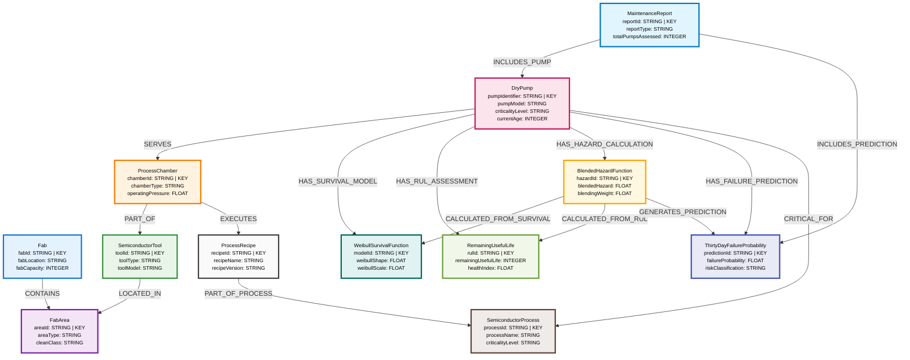

# P002 Knowledge Graph Visualization

## Knowledge Graph Structure Overview

The diagram above shows the complete knowledge graph structure for pump P002, demonstrating all entity types and their relationships in the predictive maintenance system.

## P002 Instance - Specific Values

For the actual P002 pump instance, here are the specific values:

### 🏭 Equipment Hierarchy
- **Fab**: FAB2 (Dresden, Germany, 75,000 wafers/month)
- **FabArea**: CVD_DEPOSITION (ISO4 cleanroom, 22.5°C)
- **SemiconductorTool**: PECVD_05 (Applied Materials Producer GT, 87% utilization)
- **ProcessChamber**: CH2 (2×10⁻⁷ Torr, 350°C target)
- **DryPump**: P002 (Pfeiffer HiPace 700, Level5 criticality, 285 days old)

### 🧮 Mathematical Models
- **WeibullSurvivalFunction**: Shape=1.68, Scale=612.35 days, 91% confidence
- **RemainingUsefulLife**: 142 days remaining, Health Index=0.28 (degrading)
- **BlendedHazardFunction**: 0.146 total hazard (40% blending weight)
- **ThirtyDayFailureProbability**: 13.6% failure risk (Class D)

### 🏭 Process Integration
- **SemiconductorProcess**: Silicon Nitride CVD (7nm technology, high criticality)
- **ProcessRecipe**: CVD_SiN_V3.2 (1×10⁻⁷ Torr requirement)
- **MaintenanceReport**: RPT_20250721_002 (daily assessment)

## Mathematical Calculation Flow

```
📊 Historical Data (247 pumps, 189 failures)
    ↓ Maximum Likelihood Fitting
📈 Weibull Model (β=1.68, η=612.35)
    ↓ Hazard Calculation: λ_W(t)
⚠️  Weibull Hazard = 0.062

📡 Real-time Telemetry (300s frequency)
    ↓ ML Condition Assessment  
📊 RUL Assessment (142 days, health=0.28)
    ↓ Hazard Calculation: λ_R(t) = 30/RUL
⚠️  Condition Hazard = 0.211

🔄 Blended Hazard Calculation
    H_30(t) = λ_W(t) + k × λ_R(t)
    H_30(t) = 0.062 + 0.4 × 0.211 = 0.146

🎯 Failure Probability Conversion
    P_30(t) = 1 - exp(-H_30(t))
    P_30(t) = 1 - exp(-0.146) = 0.136 (13.6%)

📊 Risk Classification
    13.6% → Risk Class D (Low-Medium Risk)
    Recommendation: Monitor Continuously
```

## Business Impact Summary

| Metric | Value | Impact |
|--------|-------|--------|
| **Pump Criticality** | Level5 | Highest business priority |
| **Process Impact** | Silicon Nitride CVD | Critical for 7nm technology |
| **Tool Utilization** | 87% | High productivity impact |
| **Failure Probability** | 13.6% | Medium risk, monitor closely |
| **Remaining Life** | 142 days | Plan replacement/maintenance |
| **Business Impact Score** | 0.78 | High financial impact if failure |

## Key Insights

### 🔍 **Predictive Analytics**
- **Early Detection**: Mathematical model predicts potential failure 142 days in advance
- **Multi-modal Assessment**: Combines historical reliability with real-time condition monitoring
- **Confidence Tracking**: 83% prediction confidence with ±2.5% uncertainty band

### ⚙️ **Operational Excellence**
- **Complete Traceability**: Full equipment hierarchy from fab to individual pump
- **Process Integration**: Direct linkage to critical manufacturing processes
- **Real-time Monitoring**: 5-minute telemetry updates with anomaly detection

### 📈 **Business Value**
- **Risk Quantification**: Converts complex analytics into actionable risk classifications
- **Maintenance Optimization**: Enables condition-based rather than calendar-based maintenance
- **Cost Avoidance**: Prevents unplanned downtime for high-value CVD processes

---

**Generated**: July 21, 2025  
**Model**: Blended Hazard v2.1.3  
**Status**: Production Example
